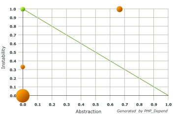
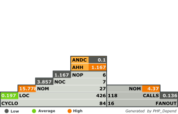

Fluidcontent: Fluid Content Elements
====================================

> **Fluid Content** enables the use of special content elements, each based on a Fluid template - much like TemplaVoila's flexible
> content elements. The feature was born in the extension FED and ported into this extension, making a very light extension with
> a simple, highly specific purpose. It uses Flux to enable highly dynamic configuration of variables used when rendering the
> template.

[](https://travis-ci.org/FluidTYPO3/fluidcontent)

## Code Quality




_Understanding the [Abstraction Instability Chart](http://pdepend.org/documentation/handbook/reports/abstraction-instability-chart.html)
and [Pyramid Chart](http://pdepend.org/documentation/handbook/reports/overview-pyramid.html)._

## What does it do?

EXT:fluidcontent lets you write custom content elements based on Fluid templates. Each content element and its possible settings
are contained in a single Fluid template file. Whole sets of files can be registered and placed in its own tab in the new content
element wizard, letting you group your content elements. The template files are placed in a very basic extension.

The _Nested Content Elements_ support that Flux enables is utilized to make content elements which can contain other content
elements - and which can be edited inline in the pgage backend module (with native drag and drop support in 6.0 and drag and drop
support in 4.x branches through the Grid Elements extension - key `gridelements`).

## Why use it?

**Fluid Content** is a fast, dynamic and extremely flexible way to create content elements. Not only can you use Fluid, you can
also create dynamic configuration options for each content element using Flux - in the exact same way as done in the Fluid Pages
extension; see https://github.com/FluidTYPO3/fluidpages.

## How does it work?

Fluid Content Elements are registered through TypoScript. The template files are then processed to read various information about
each template, which is then made available for use just as any other content element type is used.

When editing the content element, Flux is used to generate the form section which lets content editors configure variables which
become available in the template. This allows completely dynamic variables (as opposed to adding extra fields on the tt_content
table and configuring TCA for each added column).

Content templates work best if they are shipped (and created) in an extension, the key of which is used by identify the content
templates in relation to the Fluid Content extension. This makes the templates excellently portable and allow you to quickly add
custom ViewHelpers used by your specific page templates. Such an extension need only contain an `ext_emconf.php` file and
optionally a static TypoScript configuration and an `ext_localconf.php` to register that TypoScript static configuration. Using
a static file makes it easy to include the content elements.

## How to include content element templates

Use the following TypoScript:

```
plugin.tx_<myextensionkey>.view {
	templateRootPath = EXT:myextension/Resources/Private/Templates/
	partialRootPath = EXT:myextension/Resources/Private/Partials/
	layoutRootPath = EXT:myextension/Resources/Private/Layouts/
}
```

And this line in ext_tables.php and ext_localconf.php (double registration _is_ necessary):

```
Tx_Flux_Core::registerProviderExtensionKey('myextensionkey', 'Content');
```

Or if your extension uses namespaces **and contain a vendor name**:

```
Tx_Flux_Core::registerProviderExtensionKey('VendorName.ExtensionName', 'Content');
```

Fluid Content transparently recognises the difference between a lowercase_underscored extension key and a Vendor.ExtensioName syntax.

> Note: the extension key you use when registering templates will also be used as extension name for the controller context used in rendering the Fluid template (in other words: things like `<v:translate>` and `{f:uri.resource()}` will use your extension's scope - and thus will create links to your extension's resources, LLL labels etc).

## The ContentController

Fluid Content emulates a `Content` object and an associated `ContentController` - therefore, Fluid Content will look for template files in the location `templateRootPath` . `/Content/` which becomes `EXT:myextension/Resources/Private/Templates/Content/`, just as if you had created a Content domain object and used a ContentController to render an action, the action corresponding to the selected content element template.

When included the content element templates are made available to select in the content element wizard in locations where you make the TypoScript available. _Because an Extbase context is used you should include the TypoScript in root templates always, never in extended templates unless you also include those in a root template_. The reason for this is a slightly off behavior that Extbase exhibits when there is no page UID available - which happens in some actions of the page backend module.

## Using an Extbase controller native to your extension

When you use an extension to provide your templates you will implicitly get the option to create a custom controller which will be used to render your individual content element templates. In addition to using your extension's scope this also allows you to use a proper controller context - including arguments. To create such a controller you only need to add the class and extend the right parent.

Each "action" method on the controller then corresponds to one template file - just like a normal Extbase controller:

```
class Tx_Myextension_Controller_ContentController extends \FluidTYPO3\Fluidcontent\Controller\AbstractContentController {

    public function defaultAction() {
        // this action renders the template EXT:myextension/Resources/Private/Templates/Content/Default.html
        // - optionally placed in another path if you override the view configuration using TypoScript.
    }

}
```

Actions which do not exist do not get called. If a template file exists but has no corresponding controller action, the default Fluid Content ContentController does the job instead.

In every way this controller is a regular controller with just a few added internal properties. However, some parts of the view does get overridden and may not act the way you expect. One such concern: do not attempt to override the `viewObjectName` - this object name has already been overridden by Flux (serving as base of Fluid Content) and overriding it again may cause ill effects, unless of course you also use a subclass of the Flux view class. There are other circumstances like this one so be prepared for some additional workarounds if you attempt overrides.

## How to create content element templates

Templates follow the rules of regular Fluid templates and has just one additional requirement: each template file must be
provided with a `<f:section name="Configuration">` which contains the Flux configuration that applies to the content element.

### An example template

```xml
{namespace fed=Tx_Fed_ViewHelpers}
{namespace flux=Tx_Flux_ViewHelpers}
{namespace widget=Tx_Fluidwidget_ViewHelpers}

<f:layout name="Content" />
<div xmlns="http://www.w3.org/1999/xhtml" lang="en"
     xmlns:flux="http://fedext.net/ns/flux/ViewHelpers"
     xmlns:widget="http://fedext.net/ns/fluidwidget/ViewHelpers"
     xmlns:f="http://typo3.org/ns/fluid/ViewHelpers">

<f:section name="Configuration">
    <flux:form id="ajax-loader" label="Ajax Loader" description="Loads content through AJAX. Requires EXT:fluidwidget">
        <flux:field.checkbox name="settings.disable" label="Disable content loading" />
        <flux:grid>
            <flux:grid.row>
                <flux:grid.column>
                    <flux:form.content name="default" label="Content elements to load through AJAX" />
                </flux:grid.column>
            </flux:grid.row>
        </flux:grid>
    </flux:form>
</f:section>

<f:section name="Preview">
	<p>
		AJAX content loading <strong><f:if condition="{settings.disable}" then="DISABLED" else="ENABLED" /></strong>
	</p>
    <flux:widget.grid />
</f:section>

<f:section name="Main">
	<f:if condition="{settings.disable}">
		<f:else>
		    <widget:content.ajaxFluxContent parentUid="{record.uid}" area="default" />
		</f:else>
	</f:if>
</f:section>

</div>
```

### An explanation of the above template

Some facts about the above sample template:

* The `flux` namespace is used for configuration, the `widget` namespace for the AJAX loading Widget.
* A `<div>` wraps the entire template, allowing tag autocompletion and attribute validation (by associating XSD schemas to each
  namespace - see https://github.com/FluidTYPO3/schemaker for more information about this feature).
* The `Content.html`  Layout file is used. It is allowed to render any section **except for the `Configuration` section**
* The `Configuration` section contains:
	* A `<flux:form>` node with the minimum allowed configuration: an ID unique to this file (among files in this same
	  extension) and a human-readable label presented to content editors when selecting page templates.
	* A `<flux:field.checkbox>` field allowing the AJAX loading to be switched off completely
	* A `<flux:grid>` with one row with one column, containing one content area allowing content editors to insert
	  the content elements which will be loaded through AJAX. __This grid is mandatory when using content areas__.
* A `Preview` section which uses Flux's grid Widget to render the actual nested content element area - this approach is used in
  every content element which can contain other content elements - and additional preview content, in this case just a short
  feedback message if AJAX is enabled or disabled. This section is not rendered from the Layout but from Flux when rendering
  Previews for content elements in the page backend module.
* The `Main` section which is rendered from the `Content` Layout and contains the actual frontend display of the content element.
  This particular element contains only a condition which can disable the AJAX loading and the Widget which performs the AJAX
  loading (Widget provided by EXT:fluidwidget - see https://github.com/FluidTYPO3/fluidwidget).

## References

Other extensions which are either dependencies of or closely related to this extension:

* https://github.com/FluidTYPO3/flux is a dependency and is used to configure how the content template variable are defined.
* https://github.com/FluidTYPO3/vhs is a highly suggested companion for Fluid Content templates, providing useful ViewHelpers.
* https://github.com/FluidTYPO3/fluidpages is a recommendation for a site built with Fluid, but is not TemplaVoila compatible.
* https://github.com/FluidTYPO3/fluidcontent_fed is a collection of general Fluid Content Elements which use FED ViewHelpers
* https://github.com/FluidTYPO3/fluidcontent_bootstrap is a collection of Fluid Content Elements for Twitter Bootstrap which
  use VHS ViewHelpers
* https://github.com/FluidTYPO3/fluidpages_bootstrap is a collection of Fluid Page templates written for Bootstrap using VHS
  ViewHelpers
